  

  

## 📌 About Me
- 🎓 **B.Tech CSE (1st Year) Student**
- 💻 Passionate about **Software Development, AI, and building real-world tech solutions**
- 🚀 **Tech Stack**
* **Frontend:** HTML, CSS, JavaScript, React
* **Backend:** Web backend development
* **Languages:** C++, Java, Python
* **Databases:** MySQL, MongoDB
* **Core Skills:** Data Structures & Algorithms (DSA) in C++
- 🧠 **Currently Working On**
- Building an **AI-powered Stock Predictor Web App** to explore how **Machine Learning + Web Development** can create intelligent applications.
- ⚡ **About Me**
* Tech enthusiast who loves exploring new technologies
* Enjoy solving problems with code
* Passionate about building impactful projects
* Continuously learning and improving as a developer
- ✨ *Always learning. Always building.*

## 🧠 My Focus Areas
- 💻 Full Stack Web Development
- 🧠 Artificial Intelligence & Machine Learning
- 📊 Data Structures & Algorithms (C++)
- ⚛️ Modern Frontend Development (React, JavaScript)
- 🗄️ Database Design & Management (MySQL, MongoDB)
- ☕ Object-Oriented Programming (Java)
- 🚀 Building Real-World Projects & Problem Solving

## 📊 GitHub Stats & Trophies

  

  

## 🛠️ Languages & Tools

> ## Programming Languages

   

> ## Frontend

   

> ## Backend

 

> ## Database

 

> ## DevOps & Cloud

> ## Tools

 

## 🔗 Connect with Me

 

<picture>
  <source media="(prefers-color-scheme: dark)" srcset="https://raw.githubusercontent.com/abozanona/abozanona/output/pacman-contribution-graph-dark.svg">
  <source media="(prefers-color-scheme: light)" srcset="https://raw.githubusercontent.com/abozanona/abozanona/output/pacman-contribution-graph.svg">
  
</picture>

  

